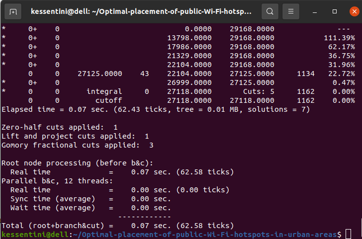

# Optimal Placement of Public Wi-Fi Hotspots in Urban Areas

This project explores the optimal placement of public Wi-Fi hotspots in urban areas using the Maximal Coverage Location Problem (MCLP) formulation. The goal is to maximize coverage for the population while efficiently allocating limited resources, ensuring equitable access to connectivity. In the MCLP, the objective is to cover the maximum population within a desired service distance $\mathcal{S}$ by optimally locating a fixed number of Wi-Fi hotspots.

  <p align="center">
    
  </p>

More formally, let $p\in\mathbb{N}$ denote the number of Wi-Fi hotspots to be placed. Let $I$ denote the finite set of demand nodes $$I = \{ 1, 2, \ldots, {|I|} \}$$ each defined in a 2-dimensional space. Each demand point $i \in I$ is associated to a demand $a_i \in \mathbb{R}$. Let $J$ denote the set of potential Wi-Fi hotspot locations $$J = \{ 1, 2, \ldots, {|J|} \}$$ with $$j = (x_j, y_j) \in \mathbb{R}^{2} \forall j \in J$$. Let $$\mathcal{S}$$ denote the distance beyond which a demand point is considered ``uncovered" and  $$d_{ij}$$ denote the distance from node $${i} \in I$$ to node $$j \in J$$. The objective is to select $$p$$ Wi-Fi hotspot locations from $$F$$ such that the number of covered demand nodes is maximized with respect to the maximal distance $$\mathcal{S}$$. Let $$y_i \in \{0, 1\}$$ be a binary variable denoting that takes value 1 if demand node $$i \in I$$ is covered, and 0 otherwise. Let $$x_{j} \in \{0, 1\}$$ be a binary variable that takes value 1 if if Wi-Fi hotspot $$i$$ is allocated to node $$j$$ and 0 otherwise.

$$
Maximize \sum_{i \in I} a_i y_i
$$

subject to  

$$\sum_{j \in N_i} x_j \geq y_i \quad \forall i \in I$$

Limited number of hotspots : 

$$\sum_{j \in J} x_{j} = p$$

Binary restrictions :

$$x_j \in \{0, 1\} \quad \forall j \in J$$
$$y_i \in \{0, 1\} \quad \forall i \in I$$

  <p align="center">
    
  </p>

### How to Run

Clone the repository :

```python
git clone https://github.com/Khouloud-Kessentini/Optimal-placement-of-public-Wi-Fi-hotspots-in-urban-areas.git
cd Optimal-placement-of-public-Wi-Fi-hotspots-in-urban-areas 
```

Run the script
```python
python optimize_wifi_hotspots.py
```

### Contributing

Contributions are welcome ! Feel free to open issues or submit pull requests to improve this project.
